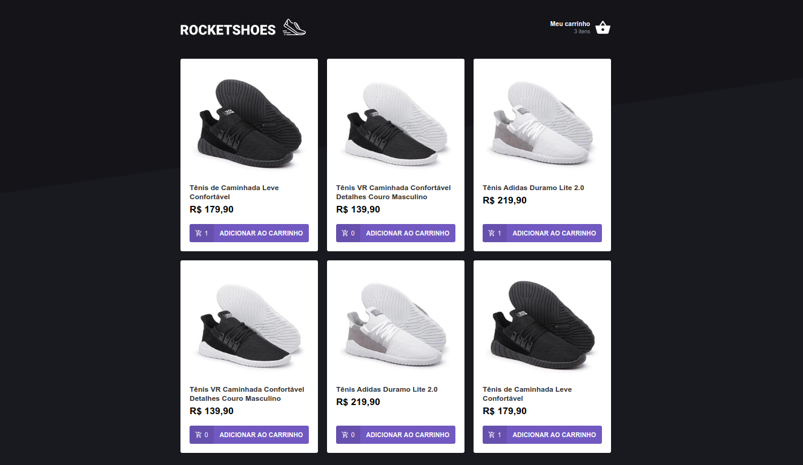

<h1 align="center">
    React RocketShoes
</h1>

<h4 align="center">
  NetShoes clone com React and Redux.
</h4>
 


## :rocket: Tecnologias

-  ReactJS
-  Redux
-  Redux-Saga
-  Immer
-  Polished
-  React-Toastify
-  styled-components
-  json-server

## :information_source: Como Rodar

Para rodar essa aplicação, você precisará ter o [Node.js](https://nodejs.org/en/) instalado no seu computador.

```bash
# Clone esse repositório
$ git clone https://github.com/israelfagundes/rocketshoes

# Navegue até a pasta do repositório
$ cd rocketshoes

# Instale as dependências
$ yarn

# Inicie o json-server
$ yarn server

# Inicie o client web
$ yarn start
```